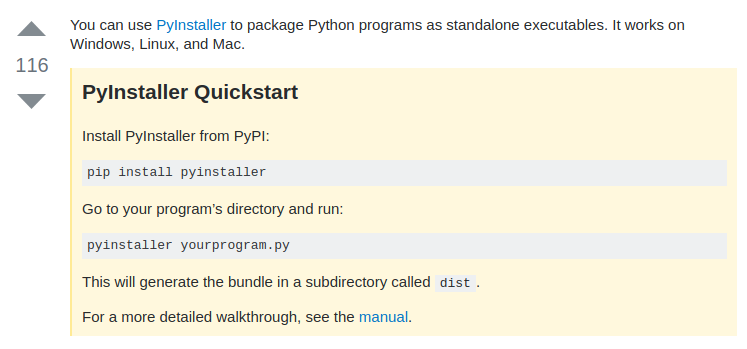
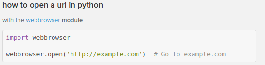
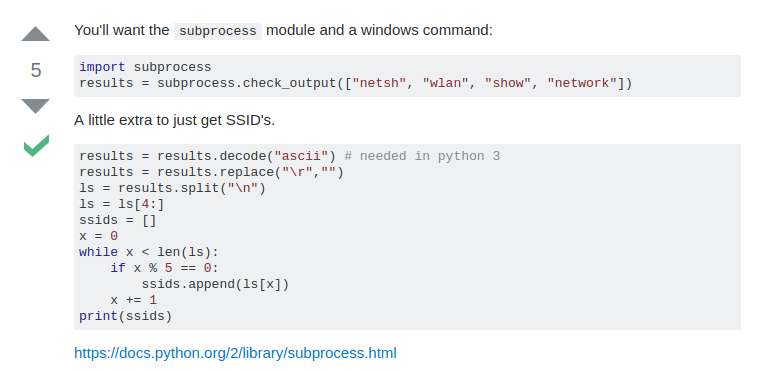

# Lösningsförslag Lokalisering i aktivitetsbaserad verksamhet.

## Tekniker - Android Applikation
Denna applikation ska populera en databas med referenspunkter för att kunna positionera
enheter i nätverket. Pre-användning av systemet.
Skanna av våningsplan. Desto mer referenspunkter desto bättre precision.

## Databasen som håller positions-data
SQL-Databas som ska hålla data om:
* referenspunkter i nätverket för positionering
* Användare
* Användares relation till referenspunkterna(position)

## Ett Python script som körs av Användare
När man startar scriptet som körs av användare av systemet ska detta ske:
1. Den promptar med ett användarnamn/userid
2. Den startar en anslutning till databasen där den lämnar uppgifter i relation till
referenspunkter som redan är definierade (detta ska ske med 20-30minuters mellanrum)
3. Den går till sajten som vi byggt som i anslutning med databasen presenterar intressant information. Medans punkt 2 sker i bakgrunden.

## Web applikation för presentation av data från databasen
* Den visar den aktuella positionen för användare som har delat med sig av det.
* Översikt på kartan med belägring
### (Utbyggnad)
* Den visar historik utifrån medarbetares tidigare position.
* Vem är mina grannar? (sitter i samma område)

## Frågeställningar
* Gdpr? Hur skyddar man användarnas integritet?
* "Spårningen" sker endast på datorn. Telefonen blir spöke
* Stöd för trådbundna anslutningar?

## Intressant information:
Bygga windows paketerad executable:

https://stackoverflow.com/questions/5458048/how-to-make-a-python-script-standalone-executable-to-run-without-any-dependency#5458807

Öppna en hemsida från ett script:

Skanna wifi info från python på windows(kanske vore bra med stöd både på windows och ubuntu, men viktigt med WINDOWS):

https://stackoverflow.com/questions/31868486/list-all-wireless-networks-python-for-pc
